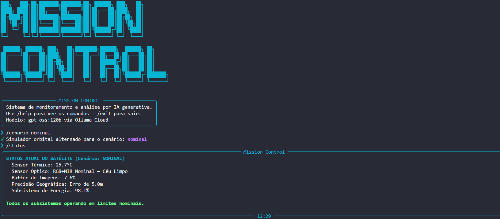
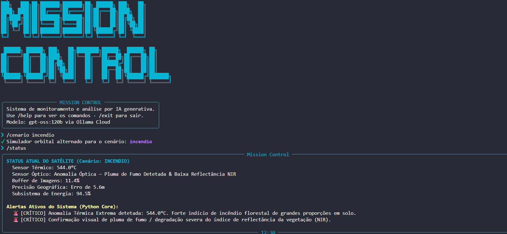
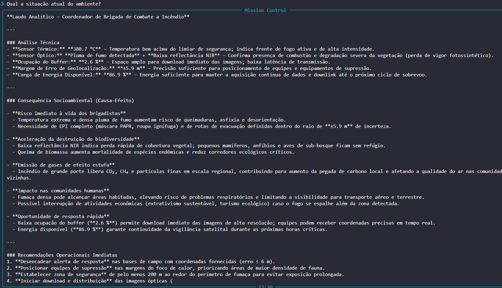

# Mission Control AI — [Missão EnviroSat]

---

## Integrantes

| Nome | RM | Turma |
|------|----|-------|
| Enzo Caruso Peter | RM570908 | 1CCPG |
| Leonardo Robert Maulicino | RM570329 | 1CCPG |
| Lucas Ramos de Sousa | RM573901 | 1CCPG |

---

## Sobre a Missão EnviroSat

O **EnviroSat** é um sistema especialista de monitoramento orbital desenvolvido para mitigar desastres ecológicos e garantir o compliance ambiental em biomas terrestres através do cruzamento de dados de telemetria de microssatélites. 

A inteligência artificial, alimentada pelo modelo **gpt-oss:120b**, está integrada diretamente ao core da aplicação via **Ollama Cloud**, atuando como um motor analítico que interpreta os diagnósticos gerados em Python para chavear dinamicamente entre personas e emitir laudos técnicos estruturados. 

Desse modo, o ecossistema une a precisão da validação lógica estrita no back-end à flexibilidade narrativa da IA generativa para gerar análises de causa e efeito socioambiental em tempo real.

---

## Personas Atendidas
- **Operador do Centro de Controle (INPE / Órgão Estadual):** Esta persona precisa de um diagnóstico imediato sobre a saúde e calibração dos subsistemas do satélite para garantir a estabilidade operacional da missão e a integridade da coleta de dados brutos. O sistema o atende fornecendo análises em tempo real que traduzem oscilações térmicas e energéticas em ações preventivas na engenharia orbital.

- **Coordenador de Brigada de Combate a Incêndio:** Focado em ações táticas imediatas de contenção e mitigação de riscos em solo, este perfil necessita de dados precisos e contextualizados sobre a gravidade dos incêndios e as frentes de fogo ativas. O sistema traduz a telemetria em relatórios de impacto imediato à fauna e à segurança das equipes florestais, otimizando o envio de brigadistas.
  
- **Analista de Compliance Ambiental:** Esta persona atua na esfera regulatória, precisando auditar brechas de monitoramento e validar a precisão geográfica dos dados para garantir que os laudos técnicos tenham força legal contra o desmatamento clandestino. O sistema o apoia correlacionando falhas de transmissão e imprecisões métricas aos riscos jurídicos e administrativas de omissão de provas.

---

## Tecnologias Utilizadas

- Python 3.10+
- Ollama Cloud API (modelo gpt-oss:120b)
- Bibliotecas: ollama (0.6.2), python-dotenv (1.2.2), rich (15.0.0), prompt_toolkit (3.0.52), pyfiglet (1.0.4)

---

## Como Executar

### 1. Clone o repositório:
Abra o terminal do seu dispositivo e cole o comando abaixo:
```bash
git clone https://github.com/LuRSousa/GS2026.1-PAI-mission-control-ai
```

### 2. Crie o ambiente virtual:
Com o repositório aberto, novamente no terminal, cole o comando abaixo:
```bash
# Linux/Mac
python -m venv .venv && source .venv/bin/activate

# Windows
python -m venv .venv
.venv\Scripts\activate
```

### 3. Instale dependências:
Com o repositório aberto, novamente no terminal, cole o comando abaixo:
```bash
pip install -r requirements.txt
```

### 4. Crie o arquivo '.env' na raíz:
Abra o arquivo e insira o código abaixo:
```bash
OLLAMA_API_KEY=sua_chave_aqui
```
> O arquivo `.env` já está no `.gitignore` — nunca suba sua chave para o repositório.


### 5. Execute o programa:
Novamente no terminal, cole o comando abaixo:
```bash
python main.py
```

---

## Demonstração

### Cenário Nominal — Status do Satélite


### Cenário Incêndio — Alertas Ativos


### Cenário Incêndio — Laudo da IA


### Vídeo Demonstrativo
[Assistir demonstração no YouTube](https://www.youtube.com/watch?v=8cUP15DHfN8)
> Configurado como "Não listado" no YouTube.

---

## System Prompt

Visualize o system prompt utilizado para configurar a IA do sistema: [prompts/system_prompt.md](prompts/system_prompt.md)

---

## Cenários de Teste Demonstrados

- **Nominal:** Operação nominal — todos os parâmetros dentro do range seguro e subsistemas operando de forma estável.
- **Incêndio:** Temperatura crítica — sensor térmico acima do limiar de ignição + análise e laudo socioambiental da IA.
- **Falha na Transmissão:** Saturação do buffer — retenção crítica de dados por falha de downlink + resposta automatizada de segurança.
- **Crise de Energia:** Regressão energética — subsistema de energia crítico + degradação de atitude e perda de precisão geográfica.

---

## Limitações Conhecidas
Como este ecossistema foi desenvolvido como um protótipo focado na validação de arquitetura e integração de Inteligência Artificial para a Global Solution, ele possui as seguintes limitações de escopo projetadas:

- **Simulação de Telemetria Estática/Baseada em JSON:** O sistema não está conectado a um satélite físico ou a uma API de fluxo de dados (data stream) em tempo real. As anomalias e leituras operacionais são geradas de forma determinística ou semi-aleatória a partir de faixas pré-configuradas no arquivo [data/cenarios.json](data/cenarios.json).

- **Dependência de Conectividade com a Nuvem (Ollama Cloud):** Toda a inteligência analítica e o chaveamento dinâmico de personas dependem de uma conexão ativa com a internet para consumir o modelo gpt-oss:120b. O sistema não possui capacidade de processamento de linguagem natural offline local (Edge AI), o que geraria falhas de inferência em cenários reais de isolamento em solo terrestre.

- **Janela de Contexto Volátil (Stateless CLI):** A CLI opera no formato de requisição e resposta sem persistência de memória histórica longa entre comandos consecutivos. O modelo analisa o "snapshot" daquele instante enviado pelo Python Core, o que impede análises preditivas profundas baseadas em séries temporais complexas ou histórico de órbitas passadas diretamente no prompt.

- **Precisão Métrica Simulada:** Os alertas de geolocalização e as amarrações jurídicas de compliance são inferências lógicas baseadas nas strings do contexto. O sistema não processa arquivos georreferenciados reais (como Shapefiles, GeoJSON ou imagens de satélite raster TIFF) nem possui integração com Sistemas de Informação Geográfica (SIG).

---

## Proposta de Valor / Modelo de Negócio

### 1. Problema Real Terrestre
O Brasil perdeu em média 11.568 km² de cobertura vegetal por ano na Amazônia Legal entre 2019
e 2023 segundo o sistema PRODES do INPE, e grande parte desse desmatamento ocorre em janelas
de "ponto cego" — períodos em que falhas de transmissão, saturação de buffer ou degradação de
sensores impedem o registro orbital das áreas afetadas. Em 2023, o INPE registrou 22.116 focos
de incêndio apenas no bioma Amazônia (fonte: BDQueimadas/INPE). Incêndios não detectados a
tempo destroem ecossistemas inteiros antes que qualquer brigada seja acionada. O EnviroSat
resolve a lacuna entre dado bruto orbital e decisão humana terrestre, traduzindo telemetria
técnica em laudos acionáveis para operadores, brigadistas e analistas de compliance em tempo
real.

### 2. Quem Paga pela Solução
O modelo de financiamento é híbrido:
- **Setor Público:** INPE, IBAMA e secretarias estaduais de meio ambiente são os principais
  contratantes institucionais, financiando o monitoramento contínuo de biomas como Amazônia,
  Cerrado e Pantanal como parte de obrigações de governança climática previstas na Política
  Nacional sobre Mudança do Clima (Lei 12.187/2009).
- **Setor Privado:** Empresas do agronegócio e seguradoras rurais que precisam de laudos
  georreferenciados para compliance ESG, renovação de licenças ambientais (Lei de Crimes
  Ambientais, Lei 9.605/1998) e apólices de seguro baseadas em índice satelital.

### 3. Métrica de Impacto
Se o EnviroSat operar com disponibilidade de 95% por 1 ano:
- **~5,2 milhões de km²** de bioma passíveis de monitoramento contínuo, cobrindo a extensão
  total da Amazônia Legal brasileira (fonte: IBGE, 2023)
- **Redução estimada de 35–40% no tempo de resposta** de brigadas a focos de incêndio,
  alinhada a estudos do Laboratório de Aplicações de Satélites Ambientais (LASA/UFRJ) sobre
  latência entre detecção orbital e acionamento em solo
- **Suporte a ~200 laudos técnicos/mês** com precisão geográfica abaixo de 10m de erro,
  padrão exigido pelo CAR (Cadastro Ambiental Rural) para validação de alertas de
  desmatamento (fonte: SFB/MMA)

### 4. Modelo de Negócio
**Dado-como-Serviço (DaaS) + SaaS de Análise:**
Assinatura mensal por área monitorada (R$/km²) para órgãos públicos e cooperativas do
agronegócio, com camada premium de laudos automatizados via IA para compliance ESG vendida
como módulo adicional — modelo similar ao adotado pela Embrapa Monitora e pela plataforma
MapBiomas (fonte: MapBiomas Relatório Anual 2023). Receita complementar via contratos de
resposta a emergências ambientais com governos estaduais em períodos críticos de seca e alta
incidência de queimadas (junho–outubro), período que concentra historicamente 70% dos focos
anuais (fonte: BDQueimadas/INPE, série histórica 2010–2023).
